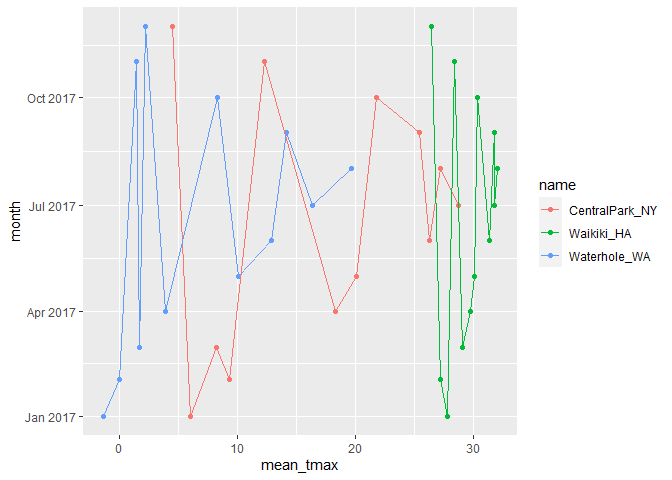

Visualization 3: Group by and Summarize
================

``` r
library(tidyverse)
library(ggridges)
library(patchwork)
library(viridis)
```

Load in a data set that we will use often (copied from p8105 website).

``` r
weather_df =  
  rnoaa::meteo_pull_monitors(
    c("USW00094728", "USC00519397", "USS0023B17S"),
    var = c("PRCP", "TMIN", "TMAX"), 
    date_min = "2017-01-01",
    date_max = "2017-12-31") %>%
  mutate(
    name = recode(
      id, 
      USW00094728 = "CentralPark_NY", 
      USC00519397 = "Waikiki_HA",
      USS0023B17S = "Waterhole_WA"),
    tmin = tmin / 10,
    tmax = tmax / 10,
    month = lubridate::floor_date(date, unit = "month")) %>%
  select(name, id, everything())
```

    ## Registered S3 method overwritten by 'hoardr':
    ##   method           from
    ##   print.cache_info httr

    ## using cached file: C:\Users\rosie\AppData\Local/Cache/R/noaa_ghcnd/USW00094728.dly

    ## date created (size, mb): 2021-10-05 10:29:43 (7.617)

    ## file min/max dates: 1869-01-01 / 2021-10-31

    ## using cached file: C:\Users\rosie\AppData\Local/Cache/R/noaa_ghcnd/USC00519397.dly

    ## date created (size, mb): 2021-10-05 10:29:56 (1.701)

    ## file min/max dates: 1965-01-01 / 2020-02-29

    ## using cached file: C:\Users\rosie\AppData\Local/Cache/R/noaa_ghcnd/USS0023B17S.dly

    ## date created (size, mb): 2021-10-05 10:30:03 (0.913)

    ## file min/max dates: 1999-09-01 / 2021-09-30

## `group_by`

``` r
weather_df %>%
  group_by(name, month)
```

    ## # A tibble: 1,095 x 7
    ## # Groups:   name, month [36]
    ##    name           id          date        prcp  tmax  tmin month     
    ##    <chr>          <chr>       <date>     <dbl> <dbl> <dbl> <date>    
    ##  1 CentralPark_NY USW00094728 2017-01-01     0   8.9   4.4 2017-01-01
    ##  2 CentralPark_NY USW00094728 2017-01-02    53   5     2.8 2017-01-01
    ##  3 CentralPark_NY USW00094728 2017-01-03   147   6.1   3.9 2017-01-01
    ##  4 CentralPark_NY USW00094728 2017-01-04     0  11.1   1.1 2017-01-01
    ##  5 CentralPark_NY USW00094728 2017-01-05     0   1.1  -2.7 2017-01-01
    ##  6 CentralPark_NY USW00094728 2017-01-06    13   0.6  -3.8 2017-01-01
    ##  7 CentralPark_NY USW00094728 2017-01-07    81  -3.2  -6.6 2017-01-01
    ##  8 CentralPark_NY USW00094728 2017-01-08     0  -3.8  -8.8 2017-01-01
    ##  9 CentralPark_NY USW00094728 2017-01-09     0  -4.9  -9.9 2017-01-01
    ## 10 CentralPark_NY USW00094728 2017-01-10     0   7.8  -6   2017-01-01
    ## # ... with 1,085 more rows

## counting things

``` r
weather_df %>% 
  group_by(month) %>% 
  summarize(n_obs = n())
```

    ## # A tibble: 12 x 2
    ##    month      n_obs
    ##    <date>     <int>
    ##  1 2017-01-01    93
    ##  2 2017-02-01    84
    ##  3 2017-03-01    93
    ##  4 2017-04-01    90
    ##  5 2017-05-01    93
    ##  6 2017-06-01    90
    ##  7 2017-07-01    93
    ##  8 2017-08-01    93
    ##  9 2017-09-01    90
    ## 10 2017-10-01    93
    ## 11 2017-11-01    90
    ## 12 2017-12-01    93

``` r
weather_df %>% 
  count(name)
```

    ## # A tibble: 3 x 2
    ##   name               n
    ##   <chr>          <int>
    ## 1 CentralPark_NY   365
    ## 2 Waikiki_HA       365
    ## 3 Waterhole_WA     365

its nice that summarize produces a data frame.

``` r
weather_df %>% 
  pull(name) %>% 
  table()
```

    ## .
    ## CentralPark_NY     Waikiki_HA   Waterhole_WA 
    ##            365            365            365

Using `table` does NOT give us a data frame, If we try to use this in
ggplot it breaks.

``` r
weather_df %>% 
  janitor::tabyl(month, name)
```

    ##       month CentralPark_NY Waikiki_HA Waterhole_WA
    ##  2017-01-01             31         31           31
    ##  2017-02-01             28         28           28
    ##  2017-03-01             31         31           31
    ##  2017-04-01             30         30           30
    ##  2017-05-01             31         31           31
    ##  2017-06-01             30         30           30
    ##  2017-07-01             31         31           31
    ##  2017-08-01             31         31           31
    ##  2017-09-01             30         30           30
    ##  2017-10-01             31         31           31
    ##  2017-11-01             30         30           30
    ##  2017-12-01             31         31           31

this is maybe useful if we need to make a table for someone else to
read.

## MOre general summaries

Let’s count, take means, looks at SDs

``` r
weather_df %>% 
  group_by(name) %>% 
  summarize(
    n_obs = n(),
    mean_tmax = mean(tmax, na.rm = T),
    median_tmax = median(tmax, na.rm = T),
    sd_tmax = sd(tmax, na.rm = T)
  )
```

    ## # A tibble: 3 x 5
    ##   name           n_obs mean_tmax median_tmax sd_tmax
    ##   <chr>          <int>     <dbl>       <dbl>   <dbl>
    ## 1 CentralPark_NY   365     17.4         18.3    9.86
    ## 2 Waikiki_HA       365     29.7         30      2.15
    ## 3 Waterhole_WA     365      7.48         5.5    7.96

adding additional groups and graphing

``` r
weather_df %>% 
  group_by(name, month) %>% 
  summarize(
    n_obs = n(),
    mean_tmax = mean(tmax, na.rm = T),
    median_tmax = median(tmax, na.rm = T),
    sd_tmax = sd(tmax, na.rm = T)
  ) %>% 
  ggplot(aes(x = mean_tmax, y = month, color = name)) +
  geom_point() +
  geom_line()
```

    ## `summarise()` has grouped output by 'name'. You can override using the `.groups` argument.

<!-- -->

Formatting table outputs

``` r
weather_df %>% 
  group_by(name) %>% 
  summarize(
    n_obs = n(),
    mean_tmax = mean(tmax, na.rm = T)
  ) %>% 
  knitr::kable(digits = 2)
```

| name            | n\_obs | mean\_tmax |
|:----------------|-------:|-----------:|
| CentralPark\_NY |    365 |      17.37 |
| Waikiki\_HA     |    365 |      29.66 |
| Waterhole\_WA   |    365 |       7.48 |

## grouped `mutate`

``` r
weather_df %>% 
  mutate(
    mean_tmax = mean(tmax, na.rm = T)
  )
```

    ## # A tibble: 1,095 x 8
    ##    name           id          date        prcp  tmax  tmin month      mean_tmax
    ##    <chr>          <chr>       <date>     <dbl> <dbl> <dbl> <date>         <dbl>
    ##  1 CentralPark_NY USW00094728 2017-01-01     0   8.9   4.4 2017-01-01      18.1
    ##  2 CentralPark_NY USW00094728 2017-01-02    53   5     2.8 2017-01-01      18.1
    ##  3 CentralPark_NY USW00094728 2017-01-03   147   6.1   3.9 2017-01-01      18.1
    ##  4 CentralPark_NY USW00094728 2017-01-04     0  11.1   1.1 2017-01-01      18.1
    ##  5 CentralPark_NY USW00094728 2017-01-05     0   1.1  -2.7 2017-01-01      18.1
    ##  6 CentralPark_NY USW00094728 2017-01-06    13   0.6  -3.8 2017-01-01      18.1
    ##  7 CentralPark_NY USW00094728 2017-01-07    81  -3.2  -6.6 2017-01-01      18.1
    ##  8 CentralPark_NY USW00094728 2017-01-08     0  -3.8  -8.8 2017-01-01      18.1
    ##  9 CentralPark_NY USW00094728 2017-01-09     0  -4.9  -9.9 2017-01-01      18.1
    ## 10 CentralPark_NY USW00094728 2017-01-10     0   7.8  -6   2017-01-01      18.1
    ## # ... with 1,085 more rows

gives mean for all observations

``` r
weather_df %>% 
  group_by(name) %>% 
  mutate(
    mean_tmax = mean(tmax, na.rm = T),
    centered_tmax = tmax - mean_tmax
  ) %>% 
  ggplot(aes(x = date, y = centered_tmax, color = name)) +
  geom_point()
```

    ## Warning: Removed 3 rows containing missing values (geom_point).

<!-- -->

Gives mean separate for each station (we also made a new centered
variable and plotted it)

``` r
weather_df %>% 
  group_by(name) %>% 
  mutate(
    tmax_rank = min_rank(tmax)
  ) %>% 
  filter(tmax_rank < 2)
```

    ## # A tibble: 3 x 8
    ## # Groups:   name [3]
    ##   name           id          date        prcp  tmax  tmin month      tmax_rank
    ##   <chr>          <chr>       <date>     <dbl> <dbl> <dbl> <date>         <int>
    ## 1 CentralPark_NY USW00094728 2017-12-28     0  -7.7 -11.6 2017-12-01         1
    ## 2 Waikiki_HA     USC00519397 2017-12-21    18  21.7  18.3 2017-12-01         1
    ## 3 Waterhole_WA   USS0023B17S 2017-01-02    25 -10.5 -12.4 2017-01-01         1

``` r
weather_df %>% 
  group_by(name) %>% 
  mutate(
    tmax_rank = min_rank(desc(tmax))
  ) %>% 
  filter(tmax_rank < 2)
```

    ## # A tibble: 4 x 8
    ## # Groups:   name [3]
    ##   name           id          date        prcp  tmax  tmin month      tmax_rank
    ##   <chr>          <chr>       <date>     <dbl> <dbl> <dbl> <date>         <int>
    ## 1 CentralPark_NY USW00094728 2017-06-13     0  34.4  25   2017-06-01         1
    ## 2 CentralPark_NY USW00094728 2017-07-20     3  34.4  25   2017-07-01         1
    ## 3 Waikiki_HA     USC00519397 2017-07-12     0  33.3  24.4 2017-07-01         1
    ## 4 Waterhole_WA   USS0023B17S 2017-08-03     0  26.4  13.3 2017-08-01         1

Lagged variables

``` r
weather_df %>% 
  group_by(name) %>% 
  mutate(
    lagged_tmax = lag(tmax, n = 1),
    tmax_dif = tmax - lagged_tmax
  ) 
```

    ## # A tibble: 1,095 x 9
    ## # Groups:   name [3]
    ##    name     id      date        prcp  tmax  tmin month      lagged_tmax tmax_dif
    ##    <chr>    <chr>   <date>     <dbl> <dbl> <dbl> <date>           <dbl>    <dbl>
    ##  1 Central~ USW000~ 2017-01-01     0   8.9   4.4 2017-01-01        NA     NA    
    ##  2 Central~ USW000~ 2017-01-02    53   5     2.8 2017-01-01         8.9   -3.9  
    ##  3 Central~ USW000~ 2017-01-03   147   6.1   3.9 2017-01-01         5      1.1  
    ##  4 Central~ USW000~ 2017-01-04     0  11.1   1.1 2017-01-01         6.1    5    
    ##  5 Central~ USW000~ 2017-01-05     0   1.1  -2.7 2017-01-01        11.1  -10    
    ##  6 Central~ USW000~ 2017-01-06    13   0.6  -3.8 2017-01-01         1.1   -0.5  
    ##  7 Central~ USW000~ 2017-01-07    81  -3.2  -6.6 2017-01-01         0.6   -3.8  
    ##  8 Central~ USW000~ 2017-01-08     0  -3.8  -8.8 2017-01-01        -3.2   -0.600
    ##  9 Central~ USW000~ 2017-01-09     0  -4.9  -9.9 2017-01-01        -3.8   -1.10 
    ## 10 Central~ USW000~ 2017-01-10     0   7.8  -6   2017-01-01        -4.9   12.7  
    ## # ... with 1,085 more rows

using summarize to find the sd of `tmax-dif`

``` r
weather_df %>% 
  group_by(name) %>% 
  mutate(
    lagged_tmax = lag(tmax, n = 1),
    tmax_dif = tmax - lagged_tmax
  ) %>% 
  summarize(dif_sd = sd(tmax_dif, na.rm = T))
```

    ## # A tibble: 3 x 2
    ##   name           dif_sd
    ##   <chr>           <dbl>
    ## 1 CentralPark_NY   4.45
    ## 2 Waikiki_HA       1.23
    ## 3 Waterhole_WA     3.13

## Limitations

what if my “summary” is a linear model

``` r
weather_df %>% 
  group_by(name) %>% 
  summarize(cor_tmin_tmax = cor(tmin, tmax, use = "complete"))
```

    ## # A tibble: 3 x 2
    ##   name           cor_tmin_tmax
    ##   <chr>                  <dbl>
    ## 1 CentralPark_NY         0.955
    ## 2 Waikiki_HA             0.638
    ## 3 Waterhole_WA           0.939

``` r
weather_df %>% 
  filter(name == "CentralPark_NY") %>% 
  lm(tmax ~ tmin, data = .)
```

    ## 
    ## Call:
    ## lm(formula = tmax ~ tmin, data = .)
    ## 
    ## Coefficients:
    ## (Intercept)         tmin  
    ##       7.209        1.039
